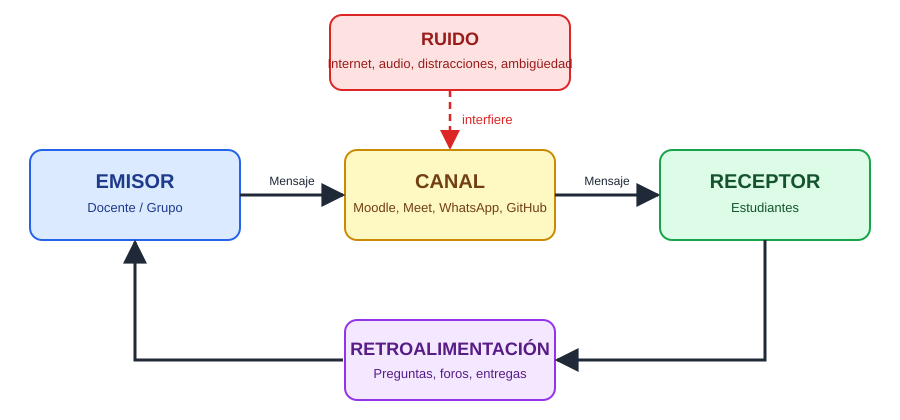

# 🧩 Planos del Aprendizaje: Armando el Circuito Comunicativo

## 📌 Título de la actividad
Plano comunicativo – Patrulla Jaguares Tecnológicos 🖥️

## 🎯 Propósito de la actividad
Visualizar los modelos de comunicación, comprendiendo cómo fluye el aprendizaje en los entornos virtuales. Mediante GitHub se diseña un circuito comunicativo que identifica roles, rutas, interferencias y conexiones reales en nuestro contexto educativo.

## 👥 Integrantes del grupo

| Nombre | Rol en el grupo | Correo / Contacto |
|---|---|---|
| José Torres | Redactor de contenidos | jose.torres1@oteima.ac.pa |
| Davis Fernández | Coordinador del grupo | davis.fernandez@oteima.ac.pa |
| Erick Santos | Gestor del repositorio GitHub y diagrama | erick.santos@oteima.ac.pa |
| Patricia Del Cid | Investigadora de modelos de comunicación | patricia.delcid@oteima.ac.pa |
| Danixa Pinto | Revisora y editora final | danixa.pinto@oteima.ac.pa |

## 🔌 Exploración de modelos de comunicación

### 1. Modelo Lineal
**Representación en clases virtuales:**
La información viaja en un solo sentido: del emisor al receptor, sin respuesta inmediata. Se da cuando el docente publica material, videos grabados, anuncios o instrucciones y el estudiante solo los recibe. Esquema: Emisor → Mensaje → Canal → Receptor.

**Ejemplo en nuestro contexto educativo:**
El docente sube a Moodle la guía de la actividad y el PDF de la lectura. Los estudiantes la descargan y la leen, pero en ese momento no hay diálogo ni confirmación de que se haya comprendido.

### 2. Modelo Interactivo
**Representación en clases virtuales:**
Emisor y receptor intercambian roles de forma alterna. Existe retroalimentación: preguntas, respuestas y aclaraciones. Se da en clases sincrónicas por videollamada, chats y foros, donde el mensaje se ajusta según la respuesta recibida.

**Ejemplo en nuestro contexto educativo:**
Durante una clase por videollamada, el docente explica un tema, un estudiante pregunta por el chat o el micrófono, el docente aclara y el estudiante confirma si entendió. En los foros de Moodle, los compañeros responden entre sí y el docente retroalimenta.

### 3. Modelo Constructivista
**Representación en clases virtuales:**
La comunicación es multidireccional y el conocimiento se construye de manera colaborativa. El estudiante es protagonista y el docente actúa como guía o mediador. Se evidencia en trabajo en equipo, debates, proyectos compartidos y herramientas colaborativas.

**Ejemplo en nuestro contexto educativo:**
Esta misma actividad: el grupo reparte roles, discute los modelos, redacta en conjunto la documentación en GitHub, integra sus experiencias y construye el circuito comunicativo con apoyo y retroalimentación del docente.

## 💭 Reflexión

**¿Qué roles asumimos como emisores y receptores?**
Los roles son dinámicos. El docente es emisor al presentar contenidos e indicaciones y receptor al recibir dudas y entregas. Los estudiantes somos receptores al recibir instrucciones y emisores al preguntar, participar en foros, exponer y subir evidencias. Dentro del grupo, cada integrante alterna ambos roles al proponer ideas y retroalimentar al resto.

**¿Qué medios utilizamos?**
- Plataforma Moodle (actividades, foros, entregas y anuncios).
- Videollamadas (Zoom, Google Meet o Microsoft Teams).
- Mensajería instantánea (WhatsApp) y correo electrónico.
- GitHub para el trabajo colaborativo y la documentación.
- Documentos compartidos, presentaciones y videos.

**¿Qué obstáculos interfieren en la comunicación?**
- Fallas de conexión a internet o de energía eléctrica.
- Mala calidad de audio o video.
- Diferencias de horario y disponibilidad entre integrantes.
- Mensajes ambiguos o instrucciones poco claras.
- Distracciones en el entorno y saturación de mensajes por distintos canales.
- Limitaciones de dominio tecnológico o de acceso a dispositivos.

## 🔧 Diseño del circuito comunicativo

| Elemento | Quién / Qué | Detalles / Ejemplos | Representación visual |
|---|---|---|---|
| Emisor | Docente / integrante del grupo que comunica | Explica el tema, publica indicaciones en Moodle, expone ideas al grupo | 🧑‍🏫 |
| Receptor | Estudiantes / resto del grupo | Reciben, interpretan y aplican la información; luego pasan a ser emisores | 🧑‍🎓 |
| Canal | Moodle, videollamada, WhatsApp, correo, GitHub | Medio por el cual viaja el mensaje: texto, voz, video o archivos | 📡 |
| Ruido | Interferencias técnicas, humanas y del entorno | Caída de internet, audio deficiente, instrucciones confusas, distracciones, choque de horarios | ⚡ |
| Retroalimentación | Respuesta del receptor al emisor | Preguntas, comentarios en el foro, confirmaciones, correcciones, entrega de la actividad | 🔄 |

## 🔄 Esquema del circuito comunicativo

```
[Emisor] ➡️ [Canal] ➡️ [Receptor]
[Receptor] ➡️ [Retroalimentación] ➡️ [Emisor]
```

El mensaje sale del emisor, viaja por un canal (Moodle, videollamada, chat) y llega al receptor, afectado en el camino por el ruido. El receptor lo interpreta y responde con retroalimentación, con lo cual cambia de rol y el ciclo se reinicia, construyendo así el aprendizaje.

## 📝 Conclusión
Los tres modelos no se excluyen, sino que se complementan en los entornos virtuales. El modelo lineal sirve para distribuir información, el interactivo para aclarar y verificar la comprensión, y el constructivista para generar aprendizaje significativo de forma colaborativa. Identificamos que el ruido (técnico, humano y del entorno) es el principal obstáculo y que la retroalimentación es el elemento que cierra el circuito y lo hace efectivo. Como grupo, reconocemos que una comunicación clara, el uso adecuado de los canales y la participación activa de todos los roles fortalecen el aprendizaje en línea.

## 📎 Evidencia visual



---

> ⚠️ **Importante:** Esta plantilla corresponde únicamente a la estructura de la actividad. No eliminar los títulos ni modificar la organización de las secciones. Complete únicamente los espacios indicados.
